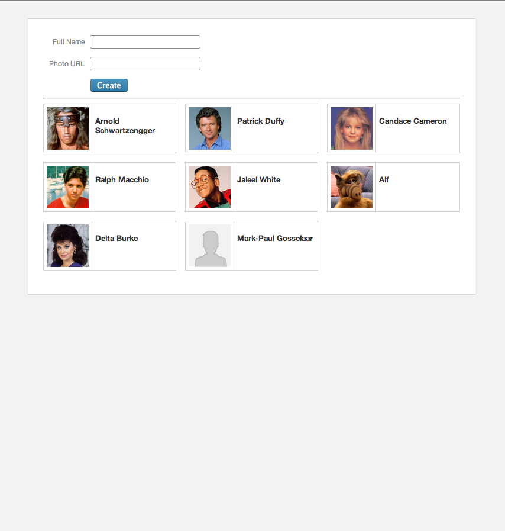
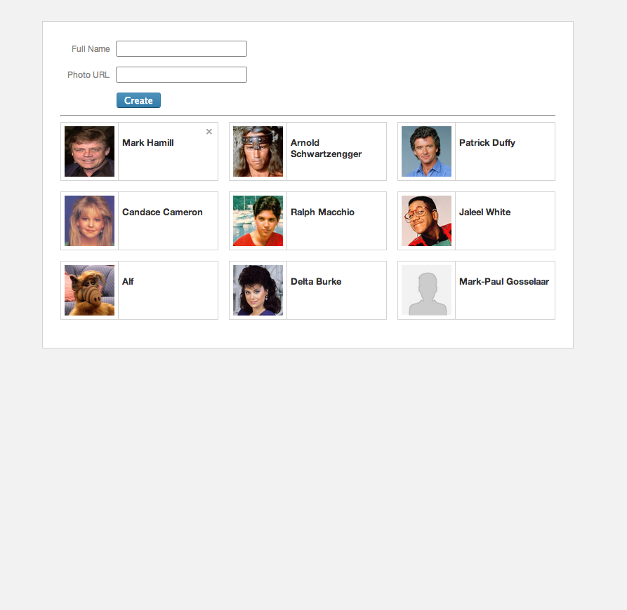
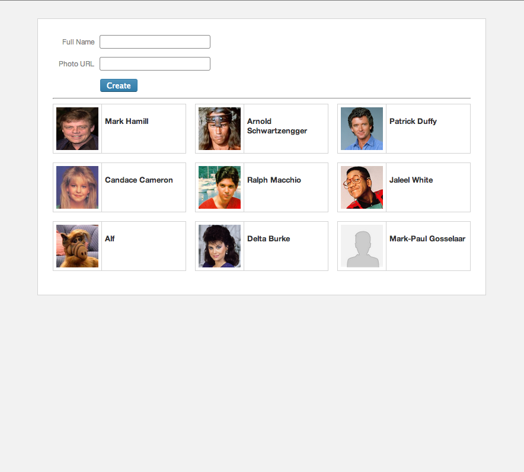

### UI Challenge

Create page from visual mock-ups and specs provided.

#### Task

Modify the provided source code to produce artifacts that match the mockups. Feel free to use the included 3rd party libraries (`jQeury`, `underscore`) if they are useful to you but please don't add any others.

Add code where indicated with (`ADD _____ HERE` comments)  in `application.css` and `index.html`. Write javascript in `application.js` uing the data provided.

Visuals for additions, hover-states, and removals are provided below.

#### Requirements

 * Only needs to work in the latest version of Chrome.
 * Things should line up and look symmetrical but please don't bother measuring. Just estimate heights, widths, padding etc.
 * Don't worry about persistence or AJAX or anything like that.
 * Cards should occur in the order of addition with newest being at the top-left.
 * Don't worry about form validation, the photo is optional.
 * After clicking the X as shown on hover, the card should be removed from the page, and the other cards should fall into place.
 * Photo URL can be to any image on the internet:
   * Don't worry about proportionate scaling, just force it to a square.
   * If no photo is provided, the default image (included) should be shown.
   
#### Visuals

**Initial**

**Hover**

**After**
